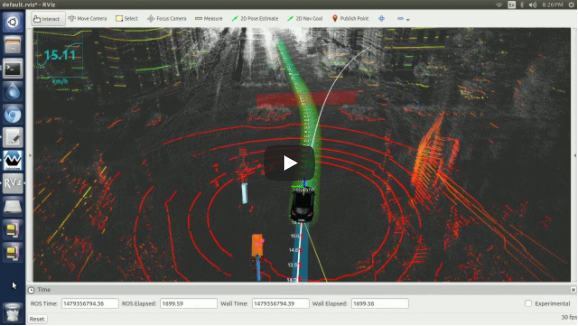

# Extended Kalman Filter - Tracking Moving Objects

In this project I implemented a Kalman filter in C++ to estimate the state of a nmoving bicycle that travels around a vehicle.

This project involves a simulator which can be downloaded [here](https://github.com/udacity/self-driving-car-sim/releases). The simulator provides simulated lidar and radar measurements of the bicycle. All in all, I used a Kalman filter, lidar measurements and radar measurements to track the bicycle's position and velocity:

  

Lidar measurements are red circles, radar measurements are blue circles with an arrow pointing in the direction of the observed angle, and estimation markers are green triangles. The gif above shows what the simulator looks like when a C++ script is using its Kalman filter to track the object. The simulator provides the script the measured data (either lidar or radar). The script feeds back the measured estimation markers and RMSE (root mean squared error) values from its Kalman filter.

Check out this video on YouTube to see a real world example of object tracking with lidar:

In this project, I only tracked one object, but the video will give you a better sense for how object tracking with lidar works
